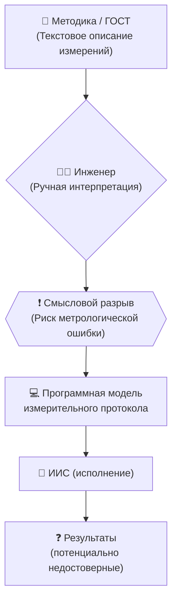
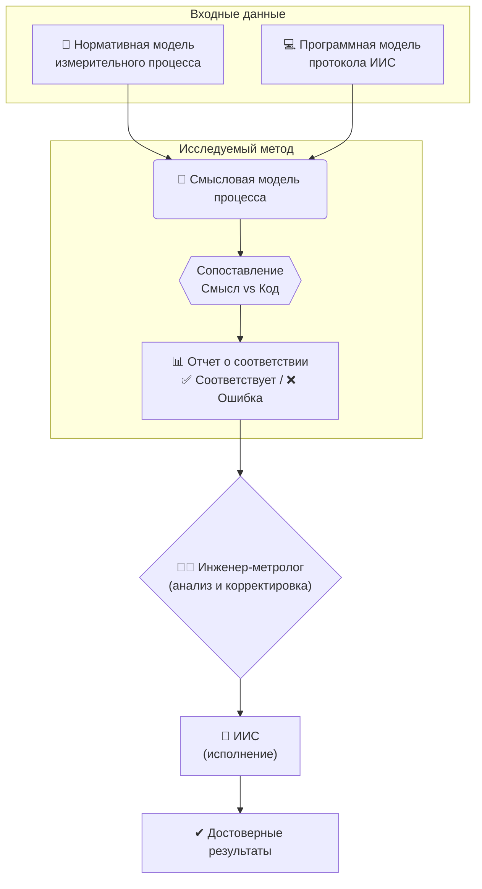

### 🏷 Предложение по теме ВКР

#### ✅ Основная:
**«Метод смысловой верификации программных моделей измерительных протоколов для повышения достоверности информационно-измерительных систем»**

#### 📎 Альтернативные формулировки:
1. **«Метод смысловой верификации программных моделей измерительных процессов в составе информационно-измерительных систем»**
2. **«Исследование метода смыслового сопоставления нормативных и исполняемых моделей измерительных протоколов в информационно-измерительных системах»**
3. **«Метод смысловой оценки соответствия программной реализации измерительных протоколов нормативной модели в информационно-измерительных системах»**

---

### 👤 Студент:
Катальшов Данила (К2-71Б)

### 🎓 Направление:
12.03.01 — Приборостроение  
**Профиль:** Информационно-измерительные системы и технологии

---

## 1️⃣ Проблема, которую решает работа

Информационно-измерительные системы (ИИС) функционируют на основе измерительных протоколов, которые определяют последовательность выполнения операций: инициализация оборудования, настройка диапазонов, выдержка, опрос сигналов, обработка результатов и т.д. Эти протоколы разрабатываются по текстовым методикам (ГОСТ, МИ, ТУ), а затем реализуются в виде программных моделей (например, LabVIEW, Python, C#, TestStand).

🔴 На практике возникает **«смысловой разрыв»** между нормативным описанием процесса и программной реализацией.  
✅ Синтаксис может быть корректным, но **смысл измерительного процесса нарушается**, что снижает метрологическую достоверность ИИС.

**Пример:** Методика требует «выдержку 300 секунд до стабилизации», но в коде из-за ошибки реализовано лишь `wait(30)`. Система отработает без ошибок синтаксиса, но измерение будет недостоверным.

📉 Последствия:
- Нарушение метрологической прослеживаемости;
- Искажение результатов испытаний;
- Повтор измерений → потери времени и ресурсов;
- Нарушение ГОСТ Р 8.563-2014 (методики выполнения измерений);
- Потеря доверия к ИИС в производственных и исследовательских условиях.

---

## 2️⃣ Цель и идея решения

🎯 **Цель** – исследовать и обосновать метод смысловой верификации, позволяющий сопоставлять программную модель измерительного протокола с его нормативной моделью для повышения достоверности ИИС.

💡 **Основная идея** – верифицировать не только синтаксическую корректность кода, но и **смысловую правильность измерительного процесса**, сопоставляя:
📄 «нормативную модель измерений» (из ГОСТ/МИ/описания эксперимента)  
💻 с «исполняемой программной моделью процесса»  

📐 Суть: обе сущности переводятся в формальную смысловую структуру (операции, параметры, логические условия), после чего проводится их смысловое соответствие.

---

## 3️⃣ Научная и инженерная основа исследования

📘 Основу исследования формируют следующие стандарты:

| Область | Нормативная база |
|--------|------------------|
| Методики измерений | ГОСТ Р 8.563-2014, ГОСТ 8.207-76 |
| Требования к ИИС | ГОСТ Р 22.2.04-95 |
| Проверка корректности ПО | ГОСТ Р ИСО/МЭК 12207-2010 |
| Качество программных моделей | ISO/IEC 25010:2011 |
| Термины и понятия ИИ | ГОСТ Р 71476-2024 (ИСО/МЭК 22989:2022) |
| Формализация процессов | ГОСТ 34.201-89, IDEF0/IDEF3 |

🧠 Метод смысловой верификации базируется на:
- формализации намерений измерительного процесса;
- построении абстрактной семантической модели;
- сопоставлении структурно-логических сегментов процесса;
- выявлении отклонений (недовыполненные, сокращённые, некорректные операции).

---

## 4️⃣ Ожидаемый результат

По итогам ВКР планируется получить:
✅ Метод смысловой верификации измерительных протоколов;  
✅ Формальные правила преобразования нормативного описания в смысловую модель;  
✅ Процедуру сопоставления программной реализации и нормативной модели;  
✅ Пример реализации метода на базовом программном прототипе (при необходимости – LabVIEW/Python);  
✅ Оценку эффективности метода на нескольких сценариях (выдержка, стабилизация, циклический опрос).

👉 При необходимости практическая часть может быть ограничена модельным примером или лабораторным макетом.

---

## 5️⃣ Визуальное представление проблемы и решения

### ⚠ Текущий процесс (со смысловым разрывом)

### ✅ Предлагаемый подход (с смысловой верификацией)
