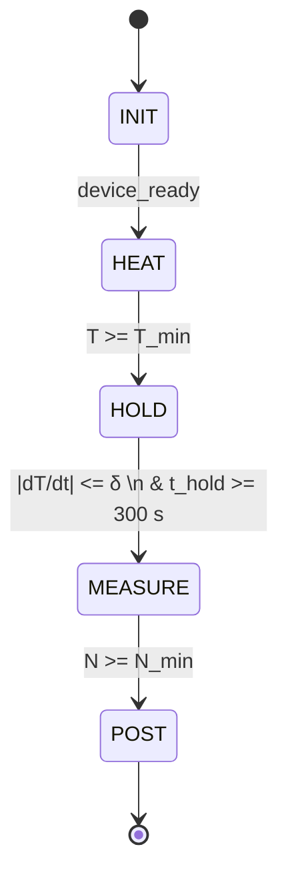
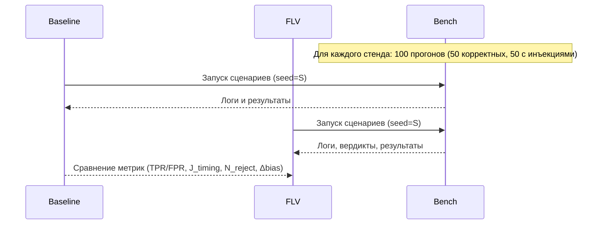
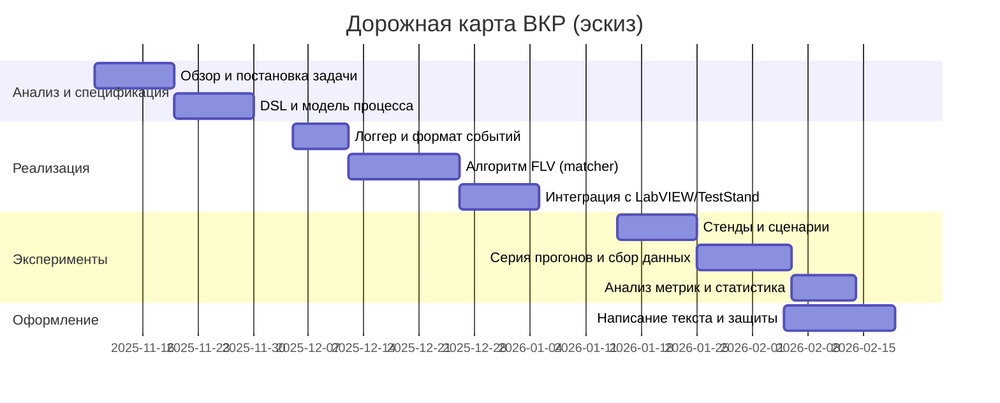

# ВКР — Метод функционально-логической верификации программных моделей измерительных процессов в составе информационно-измерительных систем

**Студент:** Катальшов Данила (К2-71Б)  
**Направление:** 12.03.01 — Приборостроение  
**Профиль:** Информационно‑измерительные системы и технологии  
**Тема:** _Метод функционально‑логической верификации программных моделей измерительных процессов в составе информационно‑измерительных систем_

---

## 1. Аннотация

В работе предлагается метод функционально‑логической верификации (FLV) программных моделей измерительных процессов, исполняемых в составе ИИС. Метод обеспечивает сопоставление фактической трассы исполнения измерительного сценария с формализованной нормативной спецификацией (структура операций, условия переходов, временные окна, параметры усреднения и диапазоны). Реализуется прототип модуля FLV, интегрируемого с LabVIEW/TestStand и/или Python‑сервисом, и демонстрируется инженерный эффект на стендах (температура, электроизмерения) через метрики детекции нарушений, временных отклонений и качества измерений.

---

## 2. Проблематика и мотивация

- Нормативная методика (ГОСТ/МИ/ТУ) описывает **последовательность и условия** измерений, но на практике программные сценарии могут **отклоняться** от требований (пропуски шагов, неверный порядок, недовыдержка, несоблюдение предикатов стабилизации и т.д.).
    
- Существующие средства: трассируемость требований, статический анализ и секвенсоры — **не обеспечивают** поведенческо‑временную верификацию фактического исполнения против **формальной** нормативной модели.
    
- В инженерном контуре ИИС нужен **встраиваемый** модуль контроля корректности процедур.
    

---

## 3. Цель, объект, предмет, задачи

**Цель:** разработать и экспериментально исследовать метод FLV, сопоставляющий фактическую трассу исполнения измерительного процесса с формальной нормативной спецификацией в составе ИИС.

**Объект:** информационно‑измерительные системы, исполняющие программные сценарии измерений.

**Предмет:** методы функционально‑логической и временной верификации программных моделей измерительных процессов.

**Задачи:**

1. Формализовать нормативные требования в виде конечного/временного автомата и спецификации (DSL, YAML/JSON).
    
2. Спроектировать формат трасс событий исполнения (event‑log) и механизм сбора логов в ИИС.
    
3. Разработать алгоритм FLV: сопоставление последовательностей, предикатов и временных окон.
    
4. Реализовать прототип модуля FLV (встраиваемый в контур LabVIEW/TestStand; гибрид с Python‑сервисом).
    
5. Провести сравнение **baseline** (типовые реализации) и **proposed** (с FLV) на стендах.
    
6. Оценить метрики (TPR/TNR/FPR/FNR, (J_{timing}), (K_{seq}), (N_{reject}), overhead, (\Delta bias)).
    

---

## 4. Обзор рынка и различия подхода (кратко)

- **Статический/редакторский контроль:** TestStand Sequence Analyzer, VI Analyzer Toolkit — проверяют стиль/правила, но **не** верифицируют поведение процесса против нормативной модели.
    
- **Трассируемость требований:** Requirements Gateway — связывает документы и артефакты, но **не** проверяет фактическую **трассу исполнения**.
    
- **Секвенсоры (Keysight/NI/R&S):** позволяют кодировать сценарии вручную; автоматической сопоставляющей верификации **нет**.
    
- **Runtime‑verification (STL/MTL):** библиотеки для контроля временных свойств сигналов; отсутствует интеграция «от текста методики → спецификация → трасса ИИС».
    

**Отличие FLV:** формальная спецификация нормативной методики + сопоставление с фактической трассой **в составе ИИС** (online/offline), с отчётом по нарушениям.

---

## 5. Нормативно‑методическая основа (используем как рамку)

- Методики измерений: ГОСТ Р 8.563‑2014, ГОСТ 8.207‑76
    
- Жизненный цикл ПО: ГОСТ Р ИСО/МЭК 12207‑2010
    
- Качество ПО/моделей: ISO/IEC 25010:2011
    
- Формализация процессов: ГОСТ 34.201‑89, IDEF0/IDEF3
    

---

## 6. Общая схема решения

```mermaid
flowchart TD
  A[📄 Нормативная методика / спецификация процесса] --> B[🧩 Формальная модель (FSM/Timed Automata)\n+ DSL YAML/JSON]
  C[💻 Программный сценарий измерений в ИИС] --> D[📝 Сбор событий исполнения\n(event log)]
  B --> E[🤖 Модуль FLV\n(верификация последовательностей/таймингов/предикатов)]
  D --> E
  E --> F{Вердикт}
  F -->|OK| G[🔬 Исполнение/Протокол измерений принят]
  F -->|FAIL| H[🚫 Блокировка/Предупреждение\n📊 Отчёт о нарушениях]
```

---

## 7. Формальная модель процесса

**Модель:** конечный автомат (stateMachine) с предикатами переходов и временными окнами; при необходимости — расширение до тайм‑автоматов/временной логики (MTL/STL) для условий стабилизации ((|dX/dt|\le δ)).

### 7.1. Пример фрагмента DSL‑спецификации (YAML)

```yaml
process: temperature_measurement
states: [INIT, HEAT, HOLD, MEASURE, POST]
params:
  T_min: 50            # °C
  delta: 0.02          # °C/s
  N_min: 20            # samples
transitions:
  - from: INIT
    to: HEAT
    guard: device_ready == true
  - from: HEAT
    to: HOLD
    guard: T >= T_min
  - from: HOLD
    to: MEASURE
    guard: abs(dT_dt) <= delta
    time_min: 300      # выдержка не менее 300 c
  - from: MEASURE
    to: POST
    guard: N >= N_min
violations:
  SEQ_MISS: "Пропущен обязательный шаг"
  TIME_UNDER: "Недостаточная выдержка"
  PRED_FAIL: "Не выполнен предикат стабилизации"
  RANGE_MISM: "Неверный диапазон измерения"
```

### 7.2. Диаграмма состояний (пример)



---

## 8. Интеграционная архитектура (LabVIEW/TestStand + Python‑монитор)

```mermaid
flowchart LR
  subgraph I[ИИС / LabVIEW]
    UI[UI Loop]
    QSM[QSM / Producer-Consumer]
    DAQ[DAQmx/SCPI]
    LOG[Event Logger (JSONL)]
    HOOK[FLV Hook VI]
  end

  subgraph P[Python Monitor]
    SPEC[Spec Loader (YAML/JSON)]
    PARSER[Log Parser]
    MATCH[Matcher (FSM/Timed checks)]
    REPORT[Verdict & Report]
  end

  QSM --> DAQ
  QSM --> HOOK
  HOOK --> LOG
  LOG -- TCP/IPC --> PARSER
  SPEC --> MATCH
  PARSER --> MATCH
  MATCH --> REPORT
  REPORT -- verdict --> UI
```

---

## 9. Стенды и сценарии

### S1. Температура со стабилизацией

- Датчик (PT100/DS18B20) → АЦП/контроллер → ПК (LabVIEW/Python)
    
- Нормативный протокол: INIT → HEAT → HOLD ((t\ge 300) c и (|dT/dt|\le δ)) → MEASURE ((N\ge N_{min})) → POST
    
- Инъекции нарушений: `t_hold=30`, `|dT/dt|>δ`, `N=5`
    

### S2. Электроизмерения (SCPI)

- Источник U/I + мультиметр → SCPI/VISA → ПК
    
- Нормативный протокол: SET_RANGE → SETTLING ((t\ge τ)) → MEASURE × N → FILTER
    
- Инъекции: пропуск `SET_RANGE`, `t_settle < τ`, `N` меньше нормы, чтение до `*OPC?`
    

---

## 10. Базовая реализация vs Предлагаемая

```mermaid
flowchart TB
  subgraph B[Baseline]
    B1[Ручное кодирование сценария в LabVIEW/TestStand]
    B2[Минимальный лог, отсутствие формальной спецификации]
    B3[Проверки точечные/ад‑hoc]
  end
  subgraph R[Proposed (FLV)]
    R1[Формальная спецификация (FSM/Timed)]
    R2[Единый event‑log]
    R3[Сопоставление последовательностей, предикатов и таймингов]
    R4[Вердикт/блокировка + отчёт]
  end
  B -->|сравнение сценариев| R
```

---

## 11. Схема событий (event‑log)

```json
{
  "ts": "2025-11-07T10:01:23.456Z",
  "stand_id": "S1",
  "run_id": "S1-000123",
  "state": "HOLD",
  "event": "HOLD_END",
  "params": {"t_hold": 285.4, "dT_dt": 0.035},
  "errors": []
}
```

**Минимальный набор событий:** `INIT_START/END, HEAT_START/END, HOLD_START/END, MEAS_TICK, MEAS_END, SET_RANGE_OK, SETTLE_START/END, ERROR`.

---

## 12. Алгоритм верификации (эскиз)

1. Загрузить спецификацию (FSM/Timed + параметры).
    
2. Нормализовать event‑log: последовательности, интервалы, агрегаты ((t_{hold}), (N), (|dX/dt|)).
    
3. Проверить **обязательные шаги** и **порядок переходов**.
    
4. Проверить **временные окна** и **предикаты**.
    
5. Сформировать отчёт: `OK/FAIL`, список нарушений с кодами и фактами (expected vs actual).
    
6. (Online) При FAIL — сигнал на блокировку/повтор.
    

---

## 13. План экспериментов



**Метрики:**

- (TPR=\frac{TP}{TP+FN}), (TNR=\frac{TN}{TN+FP}), (FPR), (FNR).
    
- (J_{timing}=\mathrm{mean},\frac{|t_{fact}-t_{spec,min}|}{t_{spec,min}}) (по критичным окнам).
    
- (K_{seq}) — доля прогонов без нарушений порядка/обязательных шагов.
    
- (N_{reject}) — число заблокированных «плохих» запусков (online режим).
    
- Overhead по времени/CPU.
    
- (\Delta bias) — смещение результата при нарушениях vs корректно.
    

**Статистика:** парные сравнения baseline vs FLV: McNemar (бинарные), t‑тест/Вилкоксона (непрерывные), эффект‑сайз (Cohen’s d), 95% CI.

---

## 14. Отчёт FLV (формат)

```json
{
  "run_id": "S2-000045",
  "verdict": "FAIL",
  "violations": [
    {"code": "TIME_UNDER", "details": {"spec_min": 300, "actual": 285.4}},
    {"code": "PRED_FAIL",  "details": {"delta_max": 0.02, "actual": 0.035}}
  ],
  "summary": {"sequence_ok": true, "timing_ok": false, "predicates_ok": false}
}
```

---

## 15. Инженерные артефакты ВКР

- Схемы стендов (электрика/структура), перечень приборов и интерфейсов (SCPI/VISA/DAQmx).
    
- Спецификация процессов (YAML/JSON) + валидатор схемы.
    
- Компонент FLV: парсер логов, сопоставление с FSM/Timed, генератор отчётов.
    
- VI‑проекты: baseline и proposed (с hook‑логгером и интеграцией FLV).
    
- Набор логов/результатов, скрипты расчёта метрик и статистики.
    

---

## 16. План‑график (эскиз)



---

## 17. Риски и меры

- **Недоступность «железа»** → эмулятор сигналов/SCPI, синтетические логи с реалистичными таймингами.
    
- **Сложность формализации** → ограничить класс процессов (2 стенда), ввести шаблоны переходов и библиотеку предикатов.
    
- **Зависимость от LLM** → LLM используется _только_ для первичного извлечения требований в DSL‑скелет; подтверждение и верификация — детерминированные.
    
- **Overhead** → асинхронный логгер (queues/user events), кэш спецификаций, сэмплинг событий.
    

---

## 18. Заключение (ожидаемые результаты)

- Метод FLV и DSL‑шаблон нормативной спецификации измерительного процесса.
    
- Прототип модуля FLV, интегрированный «в составе ИИС».
    
- Экспериментальные данные и статистически подтверждённые метрики улучшения контроля корректности исполнения процедур.
    
- Рекомендации по внедрению в ИИС (LabVIEW/TestStand/Python‑контур).
    

---

## Приложение A. Полный шаблон DSL (черновик)

```yaml
$schema: "https://example.org/flv-spec.schema.json"
meta:
  id: S1-temp-v1
  version: 1.0
  unit_system: SI
process:
  name: temperature_measurement
  objective: "Съём температуры после стабилизации"
states:
  - name: INIT
    required: true
  - name: HEAT
  - name: HOLD
  - name: MEASURE
  - name: POST
parameters:
  T_min: {type: float, unit: "°C", min: 30, default: 50}
  delta: {type: float, unit: "°C/s", max: 0.02}
  N_min: {type: int,   min: 1, default: 20}
transitions:
  - from: INIT
    to: HEAT
    guard: device_ready == true
  - from: HEAT
    to: HOLD
    guard: T >= T_min
  - from: HOLD
    to: MEASURE
    guard: abs(dT_dt) <= delta
    time:
      min: 300
  - from: MEASURE
    to: POST
    guard: N >= N_min
checks:
  - kind: sequence
    must_include: [INIT, HEAT, HOLD, MEASURE]
  - kind: timing
    state: HOLD
    min_duration: 300
  - kind: predicate
    when: transition(HOLD->MEASURE)
    condition: abs(dT_dt) <= delta
violations_catalog:
  SEQ_MISS: "Пропуск обязательного шага"
  TIME_UNDER: "Недостаточная выдержка"
  PRED_FAIL: "Предикат стабилизации не выполнен"
  N_TOO_LOW: "Недостаточное число измерений"
```

## Приложение B. Пример отчёта о нарушениях (сводка)

```markdown
# Сводка FLV — стенд S1, серия 2025‑11‑20
- Прогонов: 100 (50 корректных / 50 с инъекциями)
- Вердикты: OK=49, FAIL=51
- Матрица ошибок (истина=нарушение):
  - TP=47, FP=2, TN=48, FN=3
- Показатели: TPR=0.94, TNR=0.96, FPR=0.04, FNR=0.06
- Среднее J_timing=0.12
- Заблокировано запусков (online): N_reject=45
```

---

> Этот артефакт можно сразу класть в пояснительную записку как «Концепция и план реализации». По ходу работы будем детализировать разделы, вставлять реальные логи, диаграммы и результаты экспериментов.