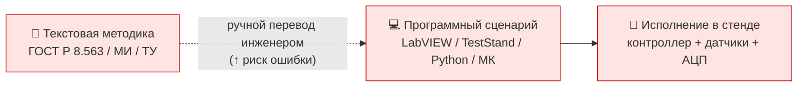
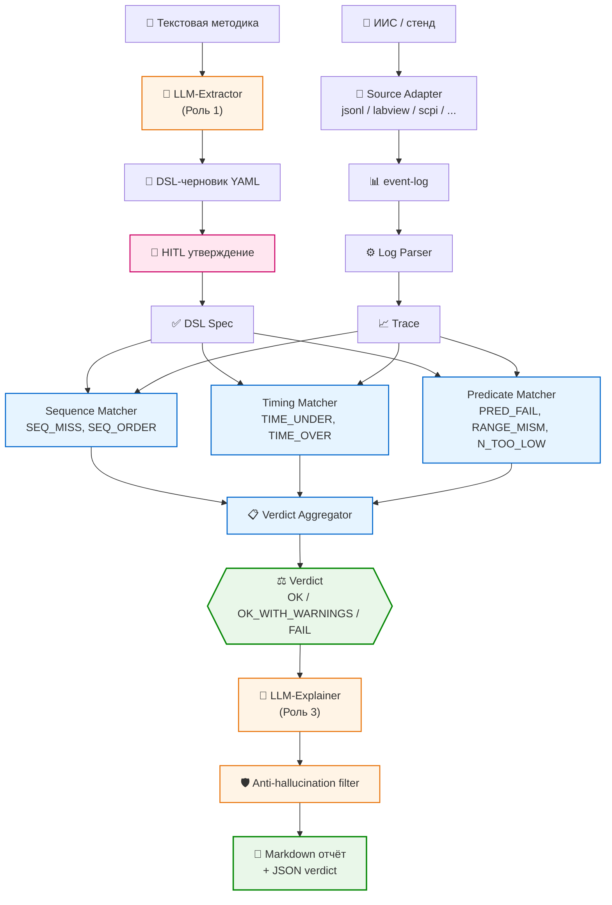

# ВКР — функционально-логическая верификация измерительных протоколов в составе ИИС

> Выпускная квалификационная работа бакалавра.
> **Катальшов Данила Алексеевич**, группа К2-81Б, кафедра К2 «Информационно-измерительная техника и технологии»,
> Космический факультет, Мытищинский филиал МГТУ им. Н.Э. Баумана.
> Направление 12.03.01 «Приборостроение», профиль 12.03.01/31.
> Научный руководитель — к.т.н., доцент, заведующий кафедрой К2 — Комаров Евгений Геннадьевич.
> Защита — после 18 июня 2026 года.

---

## Тема и аннотация

**Тема ВКР.** «Метод функционально-логической верификации программных моделей измерительных процессов в составе информационно-измерительных систем».

**Проблема.** Современные информационно-измерительные системы реализуют методики измерений из ГОСТ Р 8.563-2009 в виде программных сценариев (LabVIEW VI, NI TestStand, Python, прошивки микроконтроллеров). Между текстовым описанием методики и кодом возникает «семантический разрыв»: код может быть синтаксически корректен, но фактически отклоняться от нормативной методики. Типовой пример — методика требует выдержки 300 секунд, в коде ошибочно `wait(30)`. Существующие средства верификации (NI TestStand Sequence Analyzer, NI VI Analyzer Toolkit, RTAMT, Breach, UPPAAL) работают на уровнях абстракции, не покрывающих эту проблему.

**Решение.** Метод функционально-логической верификации (FLV) — гибридная LLM-формальная система с тремя ролями LLM и детерминированным матчером в ядре. Реализован как **переиспользуемый pluggable-фреймворк** с четырьмя точками расширения, что позволяет подключать его к любым ИИС без переписывания ядра.

**Научная новизна.** (1) Формальная модель измерительной методики в виде расширенного тайм-автомата с явным каталогом нарушений, привязанных к пунктам нормативных документов; (2) предметно-ориентированный язык описания методик в YAML с семантикой приёма трассы по трём условиям — последовательности, длительностям, предикатам; (3) гибридная архитектура с жёстко ограниченной ролью LLM на этапах извлечения и объяснения и детерминированным матчером для юридически воспроизводимого вердикта; (4) набор метрик функционально-логической прослеживаемости (TPR/TNR/FPR/FNR, J<sub>timing</sub>, K<sub>seq</sub>) для количественной оценки соответствия программной реализации нормативной методике.

---

## Архитектура

### Проблема: семантический разрыв в ИИС



Между нормативной методикой и кодом возникает **семантический разрыв**.
Существующие средства (TestStand SA, VI Analyzer, RTAMT, UPPAAL) работают
на уровнях абстракции, не покрывающих эту проблему.

### Решение: FLV-фреймворк закрывает разрыв



**Ключевая идея гибридной архитектуры (ADR-002):**

| Цвет | Компонент | Роль |
|---|---|---|
| 🟧 оранжевый | `LLM-Extractor`, `LLM-Explainer`, `Anti-hallucination` | LLM работает там, где он силён — текст ↔ структура. Анти-галл фильтр контролирует фактологию. |
| 🟦 синий | `Sequence/Timing/Predicate Matcher`, `Aggregator` | Детерминированное ядро — `O(n)` проход, никаких внешних API в горячем пути. **Юридически воспроизводимый** verdict. |
| 🟪 розовый | `HITL утверждение` | Инженер несёт ответственность за корректность нормативной модели. LLM-черновик не имеет силы без подписи. |
| 🟢 зелёный | `Verdict`, `Report` | Итог + сертификат соответствия для архива прогона. |

### Pluggable framework — четыре точки расширения (ADR-004)

| Группа entry-points | Встроено | Заглушки/расширения для пост-защиты |
|---|---|---|
| `flv.source_adapter` | `jsonl` | `labview` (TDMS+VI), `teststand` (XML), `scpi`, `serial` (Wokwi/Velxio), `otel` (OpenTelemetry) |
| `flv.dsl_adapter` | `yaml` | `rtamt` (STL/MTL), `sysml` (OMG state-machine) |
| `flv.matcher` | `sequence`, `timing`, `predicate` | `stl` (через RTAMT для непрерывных сигналов) |
| `flv.llm_provider` | `openrouter` (5 моделей: Gemini Flash 3, GPT 5.4, Claude Sonnet 4.6, DeepSeek V4 Flash, Qwen3.6 Flash), `mock` | `anthropic`, `openai`, `onprem` (Llama / Yandex GPT) |

Сторонние пакеты регистрируют свои реализации через стандартные Python
entry-points — ядро FLV не нужно править.

Подробнее: [`02_Спецификация/architecture.md`](./02_Спецификация/architecture.md),
[ADR-002](./99_Артефакты/ADR_002_role_of_LLM.md),
[ADR-004](./99_Артефакты/ADR_004_flv_as_pluggable_framework.md).

---

## Структура репозитория

```
.
├── README.md                         ← этот файл
├── CLAUDE.md                         ← операционные правила использования AI-ассистента
├── ВКР_План.md                       ← мастер-план с прогрессом по фазам
├── ВКР_План_Phase{1..7}_*.md         ← детализация каждой фазы
│
├── 01_Источники/                     ← 30 верифицированных источников
│   ├── 01_ГОСТ/                      ←  7 ГОСТов в полнотекстовом виде
│   ├── 02_ФГОС/                      ←  ФГОС 12.03.01 (Приказ № 945, 2017)
│   ├── 03_МГТУ/                      ←  Положение о ВКРБ + бланк К4 МФ МГТУ
│   ├── 04_Литература/01_FLV_RV/      ←  10 работ по STL/MTL/Timed Automata
│   ├── 04_Литература/02_Метрология/  ←  10 русских работ по ИИС/метрологии
│   ├── 05_Аналоги/                   ←  Сравнительная таблица 10 инструментов
│   └── BIBLIO.bib                    ←  Сводная BibTeX-библиография
│
├── 02_Спецификация/                  ← Phase 2: формализация
│   ├── dsl_v1.yaml                   ←  Полная DSL-спецификация для S1
│   ├── flv_dsl.schema.json           ←  JSON Schema для DSL
│   ├── event_log.schema.json         ←  Schema формата JSONL event-log
│   ├── event_log_format.md           ←  Описание формата события
│   ├── formal_model.md               ←  Timed FSM с математической нотацией
│   ├── violations_catalog.md         ←  Каталог 7 кодов нарушений
│   ├── architecture.md / .mmd        ←  Архитектура FLV-модуля + Mermaid
│   ├── simulator_arch.md             ←  Архитектура симулятора
│   ├── positioning.md                ←  Куда FLV встраивается в ИИС
│   └── validate.py                   ←  Валидатор DSL по Schema
│
├── 03_Симулятор/                     ← Phase 3: симулятор стенда S1 (термокамера + PT100)
│   ├── pyproject.toml                ←  scipy, simpy, pint, uncertainties, control
│   ├── sim/                          ←  Ядро симулятора
│   │   ├── config.py                 ←   все физ. параметры через pint
│   │   ├── thermal_model.py          ←   ODE через scipy.integrate.solve_ivp
│   │   ├── uncertainty_model.py      ←   GUM/ГОСТ 8.207-76 + t-Стьюдента
│   │   ├── sensor.py                 ←   PT100 (ГОСТ 6651) + АЦП с инерцией
│   │   ├── control_loop.py           ←   PID + Bode/step через python-control
│   │   ├── scenario_runner.py        ←   FSM на simpy с хуками для injector
│   │   ├── injector.py               ←   8 InjectionSpec (NONE + 7 кодов)
│   │   ├── event_logger.py           ←   JSONL по схеме Phase 2
│   │   └── cli.py                    ←   sim run / list-injections / list-scenarios
│   ├── viz/                          ←  Визуализация
│   │   ├── pyvista_3d.py             ←   3D-сцена термокамеры (pyvista + trame)
│   │   ├── dashboard_dash.py         ←   Plotly Dash live-дашборд
│   │   └── plot_static.py            ←   matplotlib publication-quality для ПЗ
│   ├── scenarios/                    ←  8 YAML-сценариев (эталон + 7 инъекций)
│   └── tests/                        ←  pytest с маркерами unit/integration
│
├── 04_FLV/                           ← Phase 4: pluggable-фреймворк FLV
│   ├── pyproject.toml                ←  4 группы entry-points для плагинов
│   ├── flv/
│   │   ├── core.py                   ←   Protocol-контракты (SourceAdapter,
│   │   │                                 DslAdapter, Matcher, LlmProvider)
│   │   │                                 + value-объекты (Event, Trace, Spec)
│   │   ├── plugins.py                ←   discovery через importlib.metadata
│   │   ├── verdict.py                ←   Violation/Verdict + aggregate()
│   │   ├── reporter.py               ←   JSON + Markdown отчёты
│   │   ├── llm_extractor.py          ←   Роль 1 LLM: текст → DSL
│   │   ├── llm_explainer.py          ←   Роль 3 LLM: verdict → объяснение
│   │   ├── anti_hallucination.py     ←   Анти-галл фильтр для LLM-вывода
│   │   ├── __main__.py               ←   CLI: flv check / validate / extract / plugins
│   │   ├── adapters/jsonl.py         ←   Source: JSONL Phase 2
│   │   ├── dsl/yaml_adapter.py       ←   DSL: YAML Phase 2
│   │   ├── matchers/                 ←   Sequence, Timing, Predicate
│   │   └── llm/                      ←   OpenRouter (5 моделей) + Mock
│   └── tests/                        ←  35+ тестов с маркерами
│
├── 05_Эксперименты/                  ← Phase 5: прогоны и статистика (предстоит)
├── 06_ПЗ/                            ← Phase 6: пояснительная записка
│   ├── Otchet_dlya_nauchruka.docx    ←  Промежуточный отчёт (готов)
│   ├── build_supervisor_docx.py      ←  Сборщик отчёта на базе шаблона К4
│   └── draft/                        ←  Markdown-черновики глав
├── 07_Презентация/                   ← Phase 7: pptx + доклад (предстоит)
│
├── 99_Артефакты/                     ← Решения и проверки
│   ├── ADR_001_emulation_diagrams.md ←   эмуляторы МК (Wokwi/Velxio) + диаграммы
│   ├── ADR_002_role_of_LLM.md        ←   три роли LLM в FLV
│   ├── ADR_003_simulator_engineering_stack.md ←  scipy/simpy/pint/...
│   ├── ADR_004_flv_as_pluggable_framework.md  ←  фреймворк с entry-points
│   ├── SIMULATOR_AUDIT_normative.md  ←   Аудит симулятора Phase 3 на соответствие
│   │                                     ГОСТ 6651-2009 / ГОСТ 8.207-76 (11/11 ✓)
│   ├── sources_compliance.md         ←   Compliance-проверка источников по РФ-законам
│   └── 00_Исходные/                  ←   Read-only: концепт, предложение по теме, план
│
└── skills/vkr-bauman-flv/            ← Кастомный Claude Code skill для проекта
    ├── SKILL.md                      ←  Главный гайд
    ├── references/                   ←  10 reference-файлов: ГОСТ 7.32, 7.0.5,
    │                                    шаблон Бауманки, IMRAD, Mermaid,
    │                                    электросхемы schemdraw, статистика и др.
    ├── agents/                       ←  8 готовых subagent-промптов
    ├── scripts/                      ←  doi_to_bibtex / validate_bibtex / md_to_docx /
    │                                    mermaid_to_png
    └── assets/                       ←  BibTeX-шаблоны, чек-лист сдачи главы
```

---

## Прогресс по фазам

| # | Фаза | Статус | Что сделано |
|---|---|---|---|
| 0 | Концептуализация (НИРС, осень 2025) | ✅ | Концепт, согласование темы, план реализации |
| 0 | Подготовка инфраструктуры | ✅ | Структура репо, CLAUDE.md, скилл `vkr-bauman-flv`, git+GitHub |
| 1 | Сбор информации | ✅ | 30 источников, 7 ГОСТов, ФГОС, аналоги, compliance-проверка |
| 2 | Спецификация и архитектура | ✅ | DSL + JSON Schema, формальная модель Timed FSM, каталог нарушений, архитектура, ADR-002/003/004 |
| 3 | Симулятор стенда S1 | ✅ | scipy ODE + simpy FSM + pint + uncertainties + python-control, 3D-визуализация (pyvista+trame), Plotly Dash, статика matplotlib, 8 сценариев, 30+ тестов |
| 4 | Модуль FLV (фреймворк) | ✅ | Pluggable-фреймворк с 4 точками расширения; YAML DSL + JSONL source; 3 матчера; 2 LLM-роли через OpenRouter; CLI; 35+ тестов |
| 5 | Эксперименты и статистика | ⏳ | 100+ прогонов, метрики TPR/TNR/FPR/FNR, McNemar, Wilcoxon, Cohen's d, bootstrap CI |
| 6 | Пояснительная записка | ⏳ | Основные главы — после Phase 5 |
| 7 | Презентация и защита | ⏳ | pptx, доклад 7-10 минут, Q&A |

---

## Технологический стек

**Симулятор стенда** — Python 3.11, `scipy.integrate.solve_ivp` для ODE, `simpy` для дискретно-событийного FSM, `pint` для единиц измерения, `uncertainties` для пропагации погрешностей, `python-control` для PID и анализа устойчивости, `pyvista` + `trame` для интерактивной 3D-сцены в браузере, `plotly.dash` для live-дашборда, `matplotlib` + `seaborn` для статики.

**Модуль FLV** — Python 3.11, `pyyaml` + `jsonschema` для DSL, `simpleeval` для безопасного eval предикатов, `pydantic` для типизированных контрактов и structured-output LLM, `openai` SDK + `tenacity` для работы с **OpenRouter** (Gemini Flash 3, GPT 5.4, Claude Sonnet 4.6, DeepSeek V4 Flash, Qwen3.6 Flash), `click` + `rich` для CLI.

**Пояснительная записка** — Markdown-черновики, сборка в Word `.docx` через `python-docx` поверх шаблона К4 МФ МГТУ, оформление по ГОСТ 7.32-2017, библиография по ГОСТ 7.0.5-2008.

**Тестирование** — `pytest` с маркерами `unit` / `integration` / `llm`; цель coverage ≥ 80 % по обоим пакетам.

---

## Quick start

### Симулятор стенда

```bash
cd 03_Симулятор
python -m venv .venv && source .venv/bin/activate
pip install -e ".[viz3d,dashboard,plots,dev]"

# Эталонный прогон
sim run --scenario scenarios/s1_correct.yaml \
        --output ../05_Эксперименты/runs/correct-001.jsonl --seed 42

# С инъекцией нарушения
sim run --scenario scenarios/s1_time_under.yaml \
        --output ../05_Эксперименты/runs/under-001.jsonl --seed 42

# Серия 50 прогонов
sim run --scenario scenarios/s1_correct.yaml --batch 50 --seed-base 1000 \
        --output-dir ../05_Эксперименты/runs/

# Интерактивная 3D-сцена в браузере
python -m viz.pyvista_3d --run ../05_Эксперименты/runs/correct-001.jsonl
# → http://localhost:8080

# Live-дашборд с FSM-state и графиком T(t)
python -m viz.dashboard_dash --run ../05_Эксперименты/runs/correct-001.jsonl
# → http://127.0.0.1:8050
```

### Модуль FLV

```bash
cd 04_FLV
python -m venv .venv && source .venv/bin/activate
pip install -e ".[llm,dev]"

# Валидация DSL
flv validate --spec ../02_Спецификация/dsl_v1.yaml

# Проверка прогона
flv check --spec ../02_Спецификация/dsl_v1.yaml \
          --log ../05_Эксперименты/runs/under-001.jsonl \
          --report verdict.md --json verdict.json

# С LLM-объяснением (требует OPENROUTER_API_KEY)
export OPENROUTER_API_KEY=sk-or-...
flv check --spec ../02_Спецификация/dsl_v1.yaml \
          --log ../05_Эксперименты/runs/under-001.jsonl \
          --report verdict.md --explain --model anthropic/claude-sonnet-4.6

# LLM-извлечение DSL из текста методики
flv extract --text methodology.txt --out spec_draft.yaml \
            --model openai/gpt-5.4

# Список доступных плагинов (4 группы entry-points)
flv plugins
```

### Тесты

```bash
# Симулятор
cd 03_Симулятор && pytest -m unit
cd 03_Симулятор && pytest -m integration

# FLV
cd 04_FLV && pytest --cov=flv --cov-report=term-missing
```

---

## Документы и ADR

* **[CLAUDE.md](./CLAUDE.md)** — правила использования AI-ассистента в работе над проектом, конвенция git-коммитов.
* **[ВКР_План.md](./ВКР_План.md)** — мастер-план с прогрессом по фазам (источник истины).
* **[ВКР_План_Phase1...7_*.md](.)** — детализация каждой фазы.
* **[02_Спецификация/positioning.md](./02_Спецификация/positioning.md)** — где FLV встраивается в ИИС, какой эффект.
* **[02_Спецификация/formal_model.md](./02_Спецификация/formal_model.md)** — формальная модель FLV с математической нотацией.
* **[02_Спецификация/architecture.md](./02_Спецификация/architecture.md)** — программная архитектура модуля FLV.
* **[ADR-001](./99_Артефакты/ADR_001_emulation_diagrams.md)** — выбор инструментов эмуляции МК (Wokwi/Velxio) и диаграмм (Mermaid/Excalidraw/schemdraw).
* **[ADR-002](./99_Артефакты/ADR_002_role_of_LLM.md)** — гибридная LLM-формальная архитектура с тремя ролями.
* **[ADR-003](./99_Артефакты/ADR_003_simulator_engineering_stack.md)** — инженерный стек симулятора (scipy/simpy/pint/uncertainties/python-control).
* **[ADR-004](./99_Артефакты/ADR_004_flv_as_pluggable_framework.md)** — FLV как pluggable-фреймворк с entry-points.
* **[SIMULATOR_AUDIT](./99_Артефакты/SIMULATOR_AUDIT_normative.md)** — аудит симулятора на соответствие ГОСТ 6651-2009 / ГОСТ 8.207-76 (11/11 ✓).

---

## Конвенция коммитов

Каждый коммит — атомарный инженерный шаг с привязкой к фазе.
Формат: `<phase>(<scope>): <subject>` + тело + `Refs:` + `Artifact:` + `Phase-progress:`.

Префиксы фаз: `p0` подготовка / `p1` сбор источников / `p2` спецификация /
`p3` симулятор / `p4` модуль FLV / `p5` эксперименты / `p6` ПЗ / `p7` защита /
`meta` мета-изменения / `fix` багфиксы.

По истории `git log` за минуту собирается дайджест работы по каждой фазе:

```bash
git log --grep "^p4" --pretty="%h %s"      # все коммиты Phase 4
git log --grep "^Refs:" | grep "^Refs:"    # все цитированные источники
git log --grep "Phase-progress:"           # все переходы статусов фаз
```

Полная конвенция — в [CLAUDE.md §2.6](./CLAUDE.md).

---

## Compliance

Все источники прошли проверку на соответствие законодательству Российской Федерации
(реестры иноагентов, нежелательных организаций, экстремистских материалов
Минюста). Подробный отчёт — [99_Артефакты/sources_compliance.md](./99_Артефакты/sources_compliance.md).

Категория риска по всем 30 записям BibTeX — `none`.

---

## Лицензия и использование

Работа выполнена в учебных целях в рамках ВКР МГТУ им. Н.Э. Баумана.
Использование сторонними лицами — по согласованию с автором.

Сторонние компоненты (open-source библиотеки, шаблон К4 МФ МГТУ, ГОСТы) —
под их собственными лицензиями (см. соответствующие файлы).

---

## Ключевые научные источники

* **Alur R., Dill D.** A Theory of Timed Automata. *Theor. Comput. Sci.*, 1994. — формальная база.
* **Maler O., Nickovic D.** Monitoring Temporal Properties of Continuous Signals. *FORMATS*, 2004. — STL.
* **Bartocci E., Falcone Y. (eds.).** Lectures on Runtime Verification. *Springer*, 2018. — современный обзор.
* **Nickovic D., Yamaguchi T.** RTAMT: Online Robustness Monitors from STL. *ATVA*, 2020. — open-source инструмент.
* **Deshmukh J., Donzé A. et al.** Robust Online Monitoring of STL. *FMSD*, 2017. — online-мониторинг.
* **ГОСТ Р 8.563-2009.** Государственная система обеспечения единства измерений. Методики (методы) измерений.
* **ГОСТ 6651-2009.** Термопреобразователи сопротивления из платины, меди и никеля.
* **ГОСТ 8.207-76.** Прямые измерения с многократными наблюдениями. Обработка результатов.
* **ГОСТ 7.32-2017.** Отчёт о научно-исследовательской работе. Структура и правила оформления.
* **JCGM 100:2008** (GUM). Guide to the Expression of Uncertainty in Measurement.

Полная библиография — `01_Источники/BIBLIO.bib` (30 записей).
