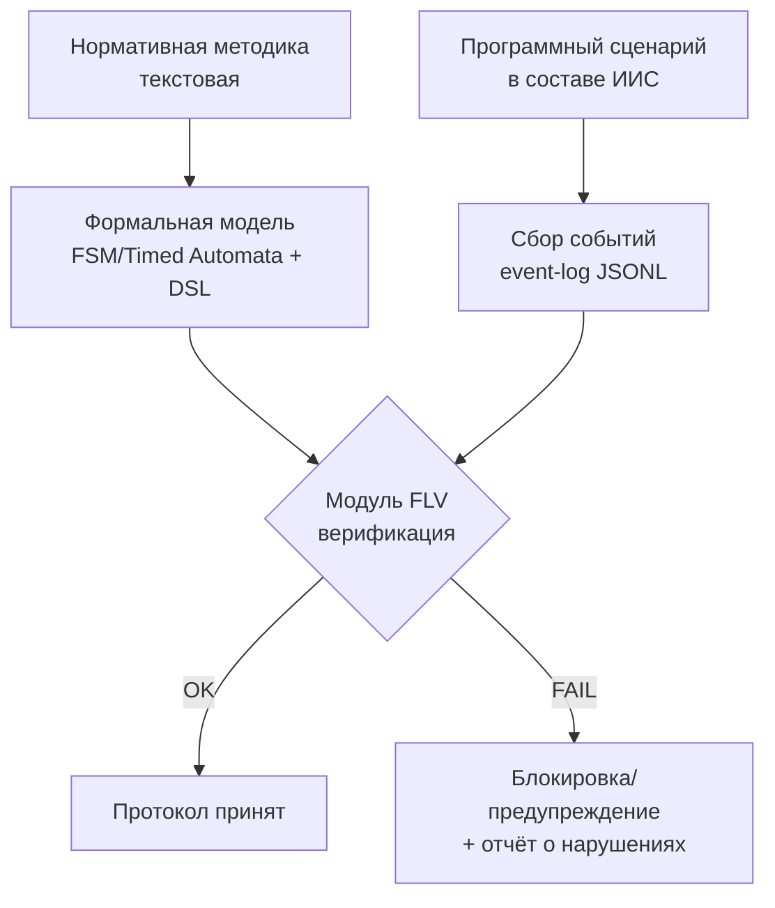
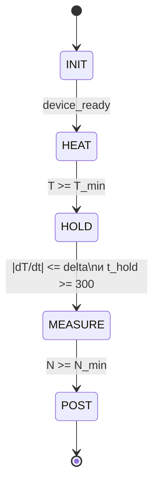
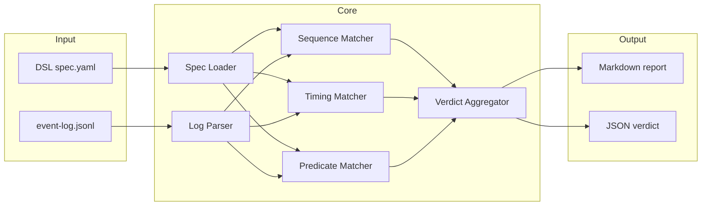
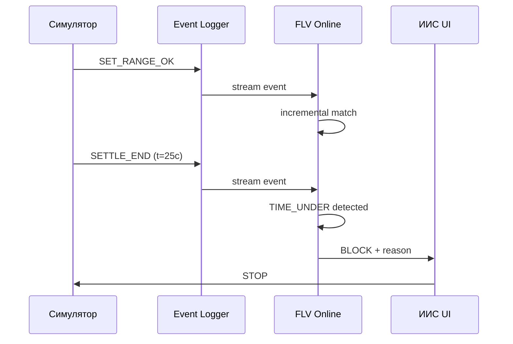
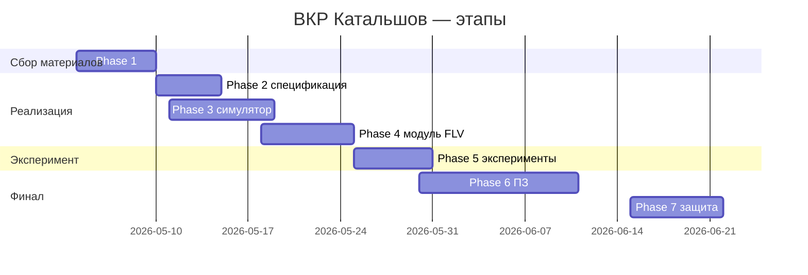

# Mermaid для FLV — синтаксис и типовые ошибки v11

Все диаграммы в работе генерируются Mermaid и рендерятся в PNG 300 DPI через `scripts/mermaid_to_png.py`. Источник Mermaid (`*.mmd`) — коммитится; PNG — тоже коммитится для воспроизводимости.

## Когда какой тип диаграммы

| Что показываем | Тип Mermaid |
|---|---|
| Архитектура модуля FLV (компоненты + потоки данных) | `flowchart LR` или `flowchart TD` |
| Контур ИИС с FLV (как FLV встраивается) | `flowchart TD` с `subgraph` |
| Состояния процесса измерения (FSM) | `stateDiagram-v2` |
| Последовательность событий (online verification trace) | `sequenceDiagram` |
| План эксперимента (фазы) | `gantt` |
| Сравнение baseline vs FLV | `flowchart TB` с двумя `subgraph` |

## Типовые ошибки v11 (фиксим заранее)

1. **Скобки в подписи узла** — Mermaid интерпретирует `(...)` как форму узла. Если в тексте нужны скобки — экранируй: `Узел["Текст (с скобками)"]` (используй квадратные `[]` или фигурные `{}` как обёртку, а внутри — двойные кавычки).
2. **Reserved words в ID узла** — `end`, `default`, `style` нельзя использовать как ID. Префиксуй: `node_end`, `s_default`.
3. **Символы `o`/`x` в начале ID узла** — Mermaid воспринимает их как стрелки, путается. Префиксуй: `n_oversee`.
4. **Точка с запятой в sequence-метках** — экранируй HTML-сущностью: `Алиса->>Боб: foo&#59; bar`.
5. **Комментарий в Mermaid** — `%%`, и обязательно с новой строки.
6. **`---` в frontmatter** — должен быть на 1-й строке файла, без пустых строк до.
7. **Markdown в подписях** — поддержан с v11. `**жирный**` и `_курсив_` работают.
8. **`linkStyle hex-color` — последний аргумент** — порядок имеет значение в v11.
9. **Стрелка без типа `---` в v11.0-11.4** — баг (рендерит без линии). Используй `-->`.

## Шаблоны под наши диаграммы

### 1. Общая схема FLV (для главы 2)



### 2. FSM измерительного процесса S1 (для главы 2)



### 3. Архитектура модуля FLV (для главы 3)



### 4. Sequence-диаграмма online-режима (для главы 3)



### 5. Календарный план (для введения)



## Рендер в PNG для вставки в ПЗ

```bash
# Установка mermaid-cli
npm install -g @mermaid-js/mermaid-cli

# Рендер одной диаграммы
mmdc -i diagram.mmd -o diagram.png -w 1600 -H 900 --backgroundColor white -s 2

# Через наш скрипт-обёртку
python scripts/mermaid_to_png.py 02_Спецификация/architecture.mmd
```

`-s 2` (scale) даёт ~300 DPI на A4. `--backgroundColor white` обязательно — иначе прозрачный фон в Word плохо смотрится.

## Где искать референсы

- Live-editor для проверки синтаксиса: <https://mermaid.live/>
- Полная документация v11: <https://mermaid.js.org/>
- Awesome-skills/mermaid-syntax-skill: <https://github.com/awesome-skills/mermaid-syntax-skill>
