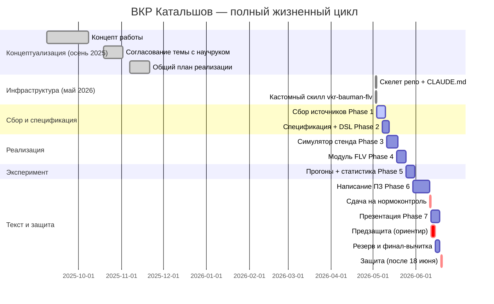

# ВКР_План.md — Мастер-план + статусы

> **Источник истины** по прогрессу ВКР. Лежит в корне рабочей папки. Обновляется в каждой сессии. Подробности фаз — в `ВКР_План_Phase1_*.md` и `ВКР_План_Phase2_*.md`.

---

## 1. Метаданные

| Поле | Значение |
|---|---|
| Студент | Катальшов Данила Алексеевич, К2-81Б |
| Направление | 12.03.01 — Приборостроение |
| Профиль | Информационно-измерительные системы и технологии |
| Тема ВКР | Метод функционально-логической верификации программных моделей измерительных процессов в составе информационно-измерительных систем |
| Финальный формат | Word (.docx), ГОСТ 7.32-2017 + ГОСТ 7.0.5-2008 |
| Целевая дата защиты | после 18 июня 2026 (предзащита ориентировочно 1-2 неделями раньше — конец первой декады июня) |
| Год поступления | сентябрь 2022 (бакалавр, 4 года обучения → выпуск 2026) |
| Действующий ФГОС | 3++, Приказ Минобрнауки № 945 от 19.09.2017 (ред. 08.02.2021) |
| Старт работы над темой | сентябрь 2025 (концепт), октябрь 2025 (формулировка темы), ноябрь 2025 (общий план) |
| Текущая дата | 2026-05-03 |
| Бюджет времени до защиты | ≈ 6-7 недель на реализацию + текст; **концептуальная база и обзорный материал собирались с сентября 2025** |
| Бюджет на железо стенда | ограничен — приоритет полной симуляции в Python; реальное железо — только если останется бюджет на компоненты после первой итерации |

---

## 2. Декомпозиция работы (фазы)

| # | Фаза | Длит. | Артефакт-выход | Статус | Дата завершения |
|---|---|---|---|---|---|
| −1 | **Концептуализация** (исторически) — формулировка темы, поиск проблематики, написание концепта/предложения, согласование с научруком | сент.-ноябрь 2025 | `99_Артефакты/00_Исходные/Концепт.md`, `Предложение_по_теме_ВКР.md`, `план_ВКР.md`, `ИДЕИ_ПОД_ВКР.md` | completed | 2025-11-07 |
| 0 | **Подготовка инфраструктуры** — структура папки, CLAUDE.md, 7 Phase-файлов, TaskList, git-репо, кастомный скилл `vkr-bauman-flv` | 1 день | `CLAUDE.md`, `ВКР_План*.md`, `skills/vkr-bauman-flv/` | completed | 2026-05-03 |
| 1 | **Сбор информации** — литература, ГОСТы, ФГОС 12.03.01, аналоги (TestStand SA, VI Analyzer, runtime-verification), методика МГТУ. Частично закрыто на этапе −1 (тема, существующие подходы, концепт-часть Положений МГТУ) | 5 дней | `01_Источники/_README.md` + база источников + `Phase1_отчёт.md` | in_progress | — |
| 2 | **Спецификация и архитектура** — DSL (YAML/JSON Schema), FSM/Timed-модель эталона, формат event-log, архитектура модуля FLV | 5 дней | `02_Спецификация/dsl_v1.yaml`, `flv_schema.json`, `architecture.mmd` | pending | — |
| 3 | **Симулятор стенда** — выбор стенда, физическая модель (теплопередача / SCPI-шина), 3D-визуализация, инъекции нарушений | 7 дней | `03_Симулятор/sim_v1.py`, `03_Симулятор/3d_view.html`, корпус scenarios | pending | — |
| 4 | **Реализация модуля FLV** — DSL-loader, matcher (sequence/timing/predicates), генератор отчётов, тесты | 7 дней | `04_FLV/flv/` (пакет), unit-tests, CLI | pending | — |
| 5 | **Эксперименты и статистика** — 100+ прогонов на сценарий, метрики (TPR/TNR/FPR/FNR, J_timing, K_seq, N_reject, overhead, Δbias), статистика (McNemar, t-test/Wilcoxon, Cohen's d, 95% CI), графики publication-quality | 5 дней | `05_Эксперименты/results.xlsx`, `05_Эксперименты/figures/*.png`, `05_Эксперименты/stat_report.md` | pending | — |
| 6 | **Написание ПЗ** — главы 1-5 (введение, аналитический обзор, теоретическая часть, экспериментальная часть, заключение), оформление по ГОСТ 7.32-2017, библиография, приложения | 10 дней | `06_ПЗ/ВКР_Катальшов.docx` | pending | — |
| 7 | **Презентация и защита** — pptx 12-15 слайдов, демо симулятора, репетиция, доклад | 4 дня | `07_Презентация/Защита_Катальшов.pptx`, `07_Презентация/Доклад.md` | pending | — |

**Сумма:** ≈ 44 рабочих дня в идеальном плане → надо параллелить (см. диаграмму ниже).

---

## 3. Календарный план (фактический, сентябрь 2025 → защита)

> Концептуальная часть и обзорный материал — нарабатывались с сентября 2025; черновики введения и аналитического обзора уже частично прорисованы в `99_Артефакты/00_Исходные/`. Май-июнь 2026 = реализация + эксперимент + текст. Защита — после 18 июня; нормоконтроль и предзащита — за 1-2 недели до защиты.

---

## 4. Зависимости

- Phase 1 → Phase 2: без обзора аналогов нельзя обосновать новизну DSL/архитектуры.
- Phase 2 → Phase 3 + Phase 4: спецификация — общий вход для симулятора и матчера.
- Phase 3 + Phase 4 → Phase 5: эксперимент = симулятор × FLV.
- Phase 5 → Phase 6 (главы 3-4): без результатов нет экспериментальной главы.
- Phase 1 → Phase 6 (глава 1-2): обзор пишется параллельно с реализацией.
- **Параллелизация:** глава 1-2 ПЗ пишется на Phase 3-4; глава 3 — на Phase 4; глава 4 — на Phase 5.

---

## 5. Артефакты (текущий каталог)

| Артефакт | Путь | Статус |
|---|---|---|
| Операционные правила | `CLAUDE.md` | ✅ создан |
| Мастер-план (этот файл) | `ВКР_План.md` | ✅ создан |
| Phase 1 — детализация | `ВКР_План_Phase1_Сбор_информации.md` | в работе |
| Phase 2-7 — детализация | `ВКР_План_Phase2_Действия.md` | в работе |
| Исходный концепт | `Концепт.md` | (read-only ref) |
| Исходное предложение | `Предложение по теме ВКР.md` | (read-only ref) |
| Исходный план | `план ВКР.md` | (read-only ref) |

---

## 6. Открытые вопросы / блокеры

| # | Вопрос | Кому | Статус |
|---|---|---|---|
| Q1 | Точная дата защиты — после 18 июня 2026 (предзащита ориентировочно 8-15 июня) | — | answered |
| Q2 | Шаблон ПЗ К2 Бауманки. Решение: пока работаем по К4 как ближайшему аналогу того же факультета; если дадут шаблон К2 — заменим | Данила | parked |
| Q3 | Доступ к ЭБС МГТУ — есть, Данила входит по запросу | — | answered |
| Q4 | Симуляция полная Python-симуляция как основной путь; реальное железо — после первой итерации, если бюджета на компоненты хватит | Данила | answered |
| Q5 | Согласован ли формат .docx (vs .pdf/LaTeX) с научруком | Данила | open |
| Q6 | Год поступления — сентябрь 2022 → ФГОС 3++ (Приказ № 945 от 19.09.2017, ред. 08.02.2021) | — | answered |

---

## 7. Журнал изменений

| Дата | Действие | Кто |
|---|---|---|
| 2026-05-03 | Создан CLAUDE.md, мастер-план, все 7 Phase-файлов отдельно; собран TaskList в Cowork; уточнены ключевые параметры (дедлайн, формат, стенд) | Данила |
| 2026-05-03 | Найдены ГОСТ 7.32-2017, ФГОС 12.03.01, ключевые работы по STL/MTL (Maler, RTAMT) для Phase 1 | Данила |
| 2026-05-03 | Получены 3 PDF МГТУ (П4 PUM, П5 OMM, П6 RPV) — уложены в `01_Источники/03_МГТУ/` | Данила |
| 2026-05-03 | Инициализирован git-репозиторий, скелет папок 01-99, README.md, .gitignore, _README.md в каждой подпапке | Данила |
| 2026-05-03 | Переезд исходных документов в `99_Артефакты/00_Исходные/`; PDF МГТУ — в `01_Источники/03_МГТУ/` | Данила |
| 2026-05-03 | В CLAUDE.md добавлены: правила использования субагентов, конвенция git-коммитов, новая структура папок | Данила |
| 2026-05-03 | Корректировка: группа К2-81Б (ранее ошибочно К2-71Б) | Данила |
| 2026-05-03 | Скачаны: Положение о ВКРБ МГТУ (12.10.2015), приложения, бланк ВКРБ К4 МФ МГТУ; ФГОС 12.03.01 (3++ Приказ 945, 3+ Приказ 959). В `01_Источники/03_МГТУ/` и `02_ФГОС/` | Данила |
| 2026-05-03 | Собран кастомный skill `vkr-bauman-flv` (SKILL.md + 9 references + 4 скрипта + assets + evals) и упакован в `.skill`-файл. Положен в `skills/` репо. Источники: K-Dense-AI, bahayonghang, awesome-skills/mermaid-syntax-skill, ifsmirnov/bachelor-diploma, schemdraw | Данила |
| 2026-05-03 | Закрыты задачи #1 (материалы) и #2 (скилл) | Данила |
| 2026-05-03 | Календарь скорректирован: учтена концептуальная фаза с сент. 2025; защита — после 18 июня 2026; Phase 0 закрыт | Данила |
| 2026-05-03 | Уточнены вопросы Q1 (защита после 18.06), Q3 (ЭБС есть), Q4 (полная Python-симуляция как primary), Q6 (поступление 2022 → ФГОС 945 3++) | Данила |
| 2026-05-03 | Репозиторий запушен на GitHub (private). Задача #11 закрыта. Phase 0 → completed | Данила |
| 2026-05-03 | Phase 1 первая волна: 7 ГОСТов + 10 работ по STL/RV/Timed Automata в репо. BIBLIO.bib = 17 записей. Задачи #12, #13 закрыты | Данила |
| 2026-05-03 | Compliance-проверка источников: все 17 записей в категории риска "none" (ГОСТы РФ + иностранная техническая академика). `99_Артефакты/sources_compliance.md` создан. Задача #15 закрыта | Данила |
| 2026-05-03 | Зафиксирован выбор стенда S1 (термокамера PT100). `03_Симулятор/_выбор_стенда.md` создан. Задача #5 закрыта | Данила |
| 2026-05-03 | Скилл `vkr-bauman-flv` дополнен 8 готовыми subagent-prompts в `agents/` (gost-fetcher, literature-searcher, chapter-writer, bibtex-validator, figure-generator, stat-analyzer, paper-auditor, compliance-checker) + reference `sources_compliance_rf.md`. Пересобран `.skill` (73 КБ). Задача #14 закрыта | Данила |
| 2026-05-03 | Phase 1: скачаны 7 ключевых ГОСТов (7.32-2017, 7.0.5-2008, 2.105-95, Р 8.563-2009, Р 8.596-2002, 8.207-76, 6651-2009) в `01_Источники/01_ГОСТ/`; составлены конспекты в `_README.md`; добавлены 7 BibTeX-записей в `BIBLIO.bib`. Замечание: запрашиваемого ГОСТ Р 8.563-2014 в реестре не существует, взята действующая редакция 8.563-2009 (с изм. 2011). Задача #12 → completed | Данила |
| 2026-05-03 | Phase 1 / поток FLV_RV: добавлены 10 BibTeX-записей в `01_Источники/BIBLIO.bib` (alur1994theory, maler2004monitoring, bartocci2018lectures, bartocci2018introduction, nickovic2020rtamt, deshmukh2017robust, donze2010breach, donze2010robust, reinbacher2014embedded, koymans1990specifying). Скачано **7 PDF** в `04_Литература/01_FLV_RV/` (Alur1994 — UPenn, Maler2004 — VERIMAG, Nickovic2020 RTAMT — arXiv 2005.11827, Deshmukh2017 — arXiv 1506.08234 + RV15-conf, Donze2010 Robust Satisfaction — VERIMAG sensiform, Reinbacher2014 — Springer Open CC-BY). 3 работы остаются closed-access (Bartocci2018 Introduction, Donze2010 Breach, Koymans1990) — нужны через ЭБС МГТУ. DOI и метаданные верифицированы через CrossRef API. Задача #13 → completed | Данила |
| 2026-05-03 | Phase 1: сравнительная таблица аналогов FLV-метода. Проанализировано 10 инструментов (4 NI + 5 RV/STL/MTL + UPPAAL) с шаблонной анкетой 14 полей. Создан `01_Источники/05_Аналоги/_сравнение.md` (карточки + сводная таблица + выводы для главы 1.3 ПЗ + 6 кандидатов в BIBLIO + compliance-секция) и `_README.md`. Тезис «семантический разрыв методика↔трасса ИИС» оформлен как обоснование ниши FLV. Задача #22 → completed | Данила |

---

## 8. Принципы корректировки плана

- Если фаза уехала больше чем на 2 дня — пересобрать календарь и явно зафиксировать новый.
- Если выявлено сокращение scope (например, отказ от 3D в пользу 2D-плотов) — записать в журнал, обновить Phase-файл.
- Если научрук просит ввести/убрать главу — корректировать Phase 6 раздел.

> **Сохраняй этот файл в актуальном состоянии — он показывает текущее положение работы. Все остальные планы (`Phase1*`, `Phase2*`) детализируют, но **прогресс отмечается здесь**.
